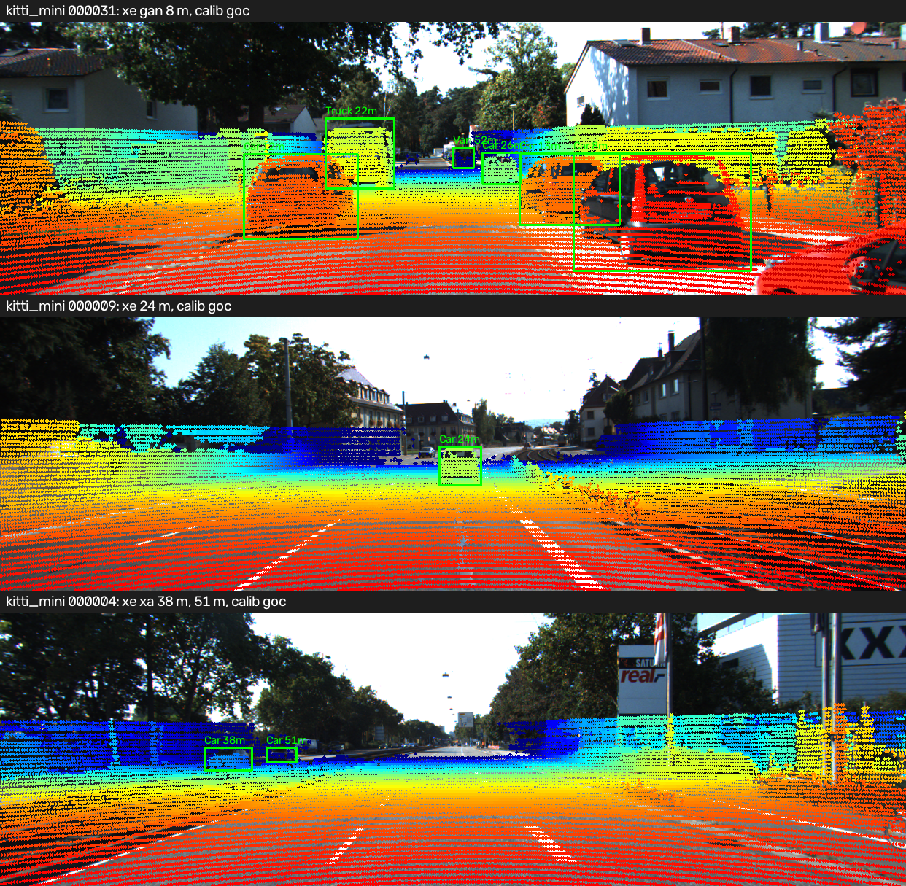
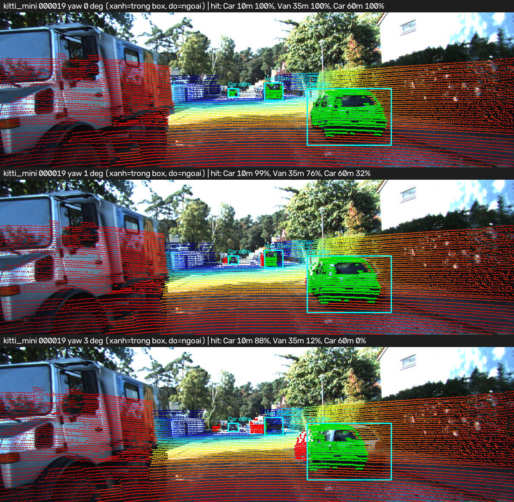
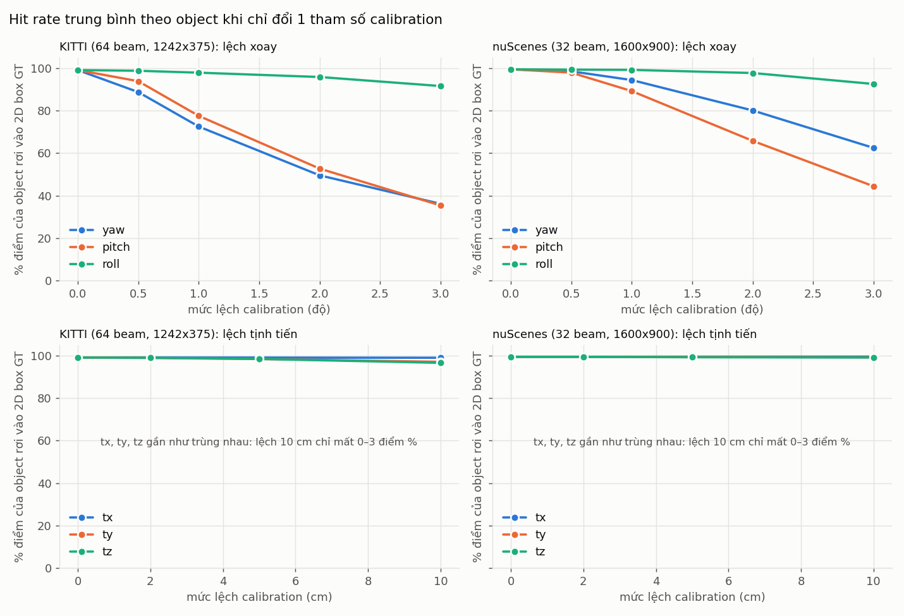
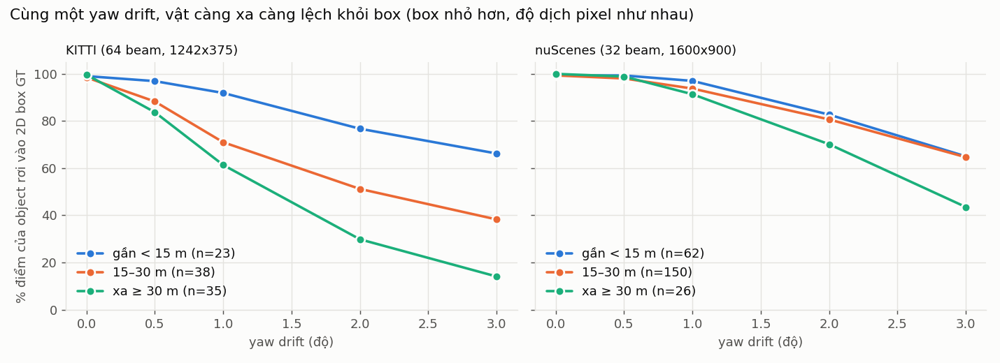
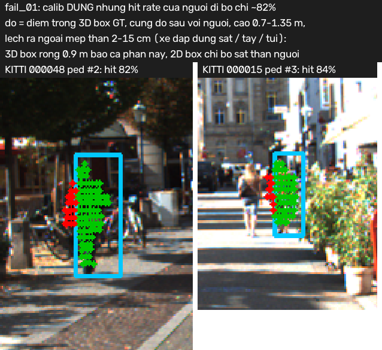
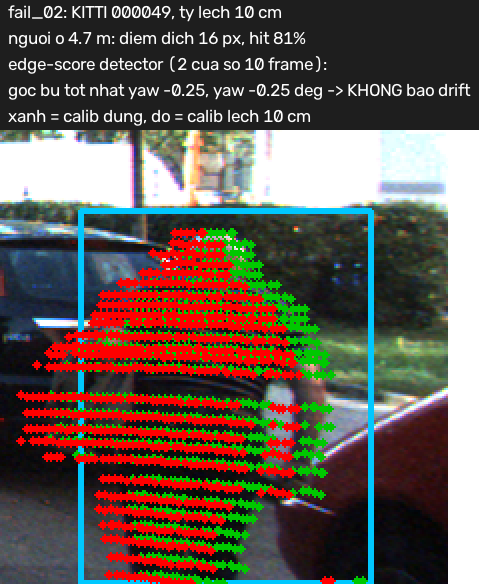
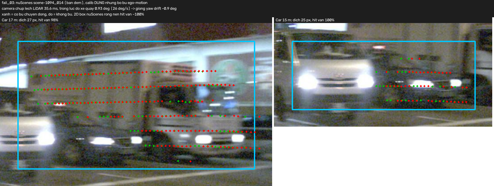

# Báo cáo Day 6: Độ nhạy của LiDAR-camera projection với calibration drift

- **Họ tên:** Văn Quốc Dũng
- **MSSV:** 2A202602505
- **Lớp:** K4 Track4
- **Link repo:** https://github.com/vvstdung89/VanQuocDung-2A202602505-Track4-Day21
- **Topic:** A — LiDAR-camera projection QA
- **Dataset:** data/kitti_mini (thí nghiệm chính), data/nuscenes_mini_subset (so sánh sensor, bonus B5), data/synthetic (debug, demo theo khoảng cách)
- **Các frame đã dùng:** toàn bộ 20 frame KITTI mini (000001 … 000061), toàn bộ 80 keyframe nuScenes (scene-0103_000 … 039, scene-1094_000 … 039), synthetic 000000 … 000004

## 1. Claim

Trên KITTI mini (96 object, 20 frame), **lệch yaw 1° làm 27% điểm LiDAR của object rơi ra khỏi 2D box GT** (hit 99.1% → 72.5%). Ảnh hưởng tăng theo khoảng cách: vật ≥ 30 m mất 38 điểm %, vật < 15 m chỉ mất 7 điểm %. Lệch tịnh tiến 10 cm chỉ mất ≤ 2.5 điểm %. Drift xoay ≥ 0.5° **phát hiện được mà không cần label** bằng edge-alignment score gộp 10 frame (ước lượng sai ≤ 0.25°, 0 báo nhầm). Riêng tịnh tiến 10 cm thì score không phát hiện được.

*Claim nháp ở CP1 ("> 10% ở yaw 1°, xa nặng hơn gần") đúng trên KITTI. Trên nuScenes thì chỉ 5 điểm %, giải thích ở mục 2.*

## 2. Evidence

**Thiết kế thí nghiệm.** Mỗi cấu hình chỉ đổi **một** tham số extrinsic so với calib gốc: yaw/pitch/roll 0.5–3° hoặc tx/ty/tz 2–10 cm. Trục tính theo xe (tiến/trái/lên). Frame, object, ngưỡng và tham số metric giữ nguyên. Các metric:

- `hit %`: lấy điểm LiDAR nằm trong 3D box GT (xác định bằng calib đúng), chiếu bằng calib lệch, rồi tính % điểm rơi vào 2D box GT của chính object đó. Trung bình theo object có ≥ 10 điểm và truncated ≤ 0.3.
- `shift px`: trung vị độ dịch pixel của mỗi điểm.
- `fov %`: % điểm chiếu vào được ảnh.

Không có phép ngẫu nhiên nào. Chạy lại cho ra CSV giống hệt nhau (đã so md5 của `calib_sweep_kitti*.csv` và `drift_detect_kitti*.csv`).

Bảng KITTI, trích từ `results/calib_sweep_summary.csv` (đủ 22 cấu hình × 2 dataset). Số object theo nhóm: gần 23, giữa 38, xa 35.

| Cấu hình (KITTI) | hit % tất cả | gần < 15 m | 15–30 m | xa ≥ 30 m | shift px p50 | fov % |
|---|---|---|---|---|---|---|
| calib gốc | 99.1 | 99.1 | 98.5 | 99.7 | 0 | 15.75 |
| yaw 0.5° | 88.7 | 96.9 | 88.3 | 83.7 | 7.3 | 15.76 |
| **yaw 1°** | **72.5** | **91.9** | **71.0** | **61.4** | 14.6 | 15.76 |
| yaw 2° | 49.5 | 76.7 | 51.2 | 29.8 | 29.1 | 15.77 |
| yaw 3° | 36.1 | 66.2 | 38.3 | 14.1 | 43.5 | 15.77 |
| pitch 1° | 77.5 | 97.3 | 86.8 | 54.4 | 13.0 | 15.02 |
| roll 3° | 91.5 | 94.4 | 90.5 | 90.8 | 14.5 | 15.79 |
| tx / ty / tz 10 cm | 99.0 / 97.1 / 96.6 | 98.7 / 97.3 / 96.1 | 98.5 / 95.6 / 95.7 | 99.6 / 98.5 / 97.8 | 2.2 / 5.8 / 5.8 | 16.1 / 15.8 / 16.5 |

- **Yaw và pitch là nguy hiểm nhất.** Một phép xoay dịch mọi điểm gần như cùng một số pixel, bất kể khoảng cách: fx·tan(1°) = 12.6 px ở tâm ảnh, trung vị đo được 14.6 px vì điểm ở rìa ảnh dịch nhiều hơn. Trong khi đó box của vật xa thì nhỏ, nên vật xa rơi khỏi box trước.
- **Roll ít ảnh hưởng.** Roll là phép xoay quanh trục quang học, nên điểm gần tâm ảnh gần như không dịch.
- **Tịnh tiến ít ảnh hưởng.** Độ dịch là f·t/z, nên 10 cm chỉ gây ≤ 6 px.
- **`fov %` không phát hiện được drift.** Ở yaw 3°, fov chỉ đổi từ 15.75 sang 15.77. Đây là một lỗi lớp Metric.






Ảnh overlay theo 3 khoảng cách trên dữ liệu synthetic (xe ở 8 m, 18 m, 35 m) nằm ở `results/figures/demo_distance_synthetic.png`. Ở frame `000019`, khi yaw 1°: xe 10 m còn 99% điểm trong box, van 35 m còn 76%, xe 60 m còn 32%.

**So sánh 2 dataset (B5): cùng thí nghiệm yaw, nuScenes ít bị ảnh hưởng hơn.**

| yaw drift | 0° | 0.5° | 1° | 2° | 3° |
|---|---|---|---|---|---|
| hit %, KITTI / nuScenes | 99.1 / 99.4 | 88.7 / 98.5 | 72.5 / 94.4 | 49.5 / 80.1 | 36.1 / 62.5 |
| shift px, KITTI / nuScenes | 0 / 0 | 7.3 / 12.6 | 14.6 / 25.2 | 29.1 / 50.3 | 43.5 / 75.2 |

Có 4 nguyên nhân khiến kết quả khác nhau:

1. **Cách tạo 2D box GT khác nhau.** Ở nuScenes, 2D box là hình chữ nhật bao 8 góc của 3D box chiếu lên ảnh, nên rộng hơn nhiều so với box người gán bó sát của KITTI. Vì vậy dù shift lớn hơn (fx = 1266), điểm vẫn nằm trong box.
2. **Hệ trục LiDAR khác nhau.** LiDAR nuScenes có x hướng sang phải, y hướng về trước, nên "pitch" của `perturb_extrinsic` (xoay trong LiDAR frame) thực chất là roll của xe. Mình phải đổi drift sang trục xe (`vehicle_axes_in_lidar` trong `src/calib_metrics.py`). Nếu không đổi, bảng sẽ cho thấy "roll nguy hiểm, pitch vô hại" trên nuScenes, tức là kết luận sai.
3. **Số beam khác nhau.** LiDAR 32 beam cho 3,029 điểm trong FOV mỗi frame (KITTI 64 beam: 18,780) và chỉ 103 điểm biên độ sâu (KITTI: 2,143). Vì vậy detector bên dưới cần gộp 40 frame thay vì 10.
4. **Camera và LiDAR chụp lệch nhau khoảng 35 ms** (lỗi Time, xem mục 3, F3).

**Advanced: phát hiện drift không cần label** (`src/drift_detect.py`, `results/drift_detect_*.csv`, ảnh `drift_detect.png`).

- **Edge score** = P(điểm biên độ sâu của LiDAR rơi trong 0.25° quanh biên Canny) − P(điểm LiDAR thường rơi trong 0.25° quanh biên Canny). Vế trừ dùng để khử thiên lệch: vùng mặt tiền nhiều chi tiết thì điểm nào cũng dễ "trúng" biên.
- **Cách dò:** xoay thử calib ±3° (bước 0.25°) quanh từng trục. Góc bù cho score cao nhất chính là ước lượng drift.
- **Ngưỡng từng frame:** đặt ở mức 5% báo nhầm. Theo cửa sổ thì gắn cờ khi |góc bù| ≥ 0.5°.

| Drift thật | KITTI: % frame bị cờ | KITTI: 2 cửa sổ 10 frame, drift ước lượng | nuScenes: 2 scene × 40 frame, drift ước lượng |
|---|---|---|---|
| không lệch | 5% (ngưỡng) | pitch 0.25°, 0° → không cờ ✓ | pitch ±0.25° → không cờ ✓ |
| yaw 0.5° / 1° / 2° | 10 / 20 / 40% | yaw 0.5, 0.5 / 1, 1 / 2, 2 ✓ | 0.5° chỉ đúng 1/2 scene; 1° và 2° đúng cả 2 (yaw 1, 1 / 2, 2.25) |
| pitch 1° | 25% | pitch 1.25, 1 ✓ | pitch 0.75, 1.5 ✓ |
| roll 1° | 10% | roll 1, 1 ✓ | đúng 1/2 scene |
| ty / tz 10 cm | 10 / 5% | không cờ ✗ (F2) | không cờ ✗ |

- **Từng frame thì yếu.** Ngay cả trên KITTI, yaw 1° chỉ bị phát hiện ở 20% frame; trên nuScenes thì gần như chỉ bằng mức báo nhầm.
- **Gộp nhiều frame thì ước lượng lại chính xác** mọi drift xoay ≥ 0.5° trên KITTI. Muốn tái hiện cửa sổ 10 frame trên nuScenes, chạy `--window 10`: 7/8 cửa sổ báo nhầm.

**Latency (B3, `results/latency.csv`).** Đo trên CPU i7-1165G7, bỏ lần chạy đầu, 30 lần, p50/p95:

| Bước (KITTI, 119k điểm) | p50 | p95 |
|---|---|---|
| Chiếu toàn bộ point cloud | 27 ms | 36 ms |
| Edge score | 49 ms | 66 ms |
| Dò drift đầy đủ (75 góc) | 214 ms | 247 ms |

## 3. Failure case

**F1: Metric hit rate báo nhầm với người đi bộ dù calib đúng (lớp Metric)**



- **Khi nào:** ở baseline, 10/96 object KITTI có hit < 98%, và **cả 10 đều là Pedestrian**. Thấp nhất là 82% (`000048` #2) và 84% (`000015` #3).
- **Vì sao:** các điểm đỏ nằm *cùng độ sâu* với người (16.23 m so với 16.21 m), ở độ cao 0.7–1.35 m, lệch ra ngoài mép thân 2–15 cm. Đó là xe đạp dựng sát người, hoặc tay, túi. 3D box GT rộng 0.9 m nên bao luôn phần này, còn 2D box chỉ bó sát phần thân nhìn thấy.
- **Hậu quả:** nếu đặt ngưỡng QA "hit ≥ 95% mỗi object" thì calib đúng vẫn bị báo drift.
- **Cách khắc phục:** đặt ngưỡng theo class, hoặc co 3D box (ví dụ còn 80% w/l) khi lấy điểm, hoặc dùng `shift px`/edge score thay cho hit.

**F2: Drift tịnh tiến 10 cm không bị edge-score detector phát hiện (lớp Geometry + Metric)**



- **Khi nào:** ty = 10 cm làm điểm của người ở 4.7 m (`000049`) dịch 16 px và hit tụt còn 81%. Thế nhưng cả 2 cửa sổ chỉ tìm ra góc bù yaw −0.25° (< 0.5°), nên không gắn cờ.
- **Vì sao:** lỗi tịnh tiến gây độ dịch f·t/z, giảm theo khoảng cách (≈ 15 px ở 5 m, ≈ 2.4 px ở 30 m). Trong khi đó, detector chỉ thử các phép xoay, vốn dịch đều ở mọi khoảng cách. Phần lớn điểm biên lại nằm ở 10–40 m, nên không có góc xoay nào "bù" được.
- **Cách khắc phục:** thêm 3 trục tịnh tiến vào bước dò và đánh trọng số cho điểm biên gần (< 15 m), hoặc kiểm tra tịnh tiến định kỳ bằng target ở xưởng.

**F3: Bỏ bù chuyển động khi xe rẽ, projection lệch dù calib đúng (lớp Time)**



- **Khi nào:** ở nuScenes, camera chụp lệch LiDAR khoảng 35.6 ms. Tại `scene-1094_014` (ban đêm), xe đang quay 26°/s, nên trong khoảng lệch đó xe xoay 0.93°. Kết quả tương đương một yaw drift ~1°: điểm lệch 25–27 px khỏi xe.
- **So sánh:** trung vị trên 80 frame là 9.2 px. Frame đi thẳng (`scene-0103_010`, 8.7 m/s) chỉ xoay 0.04°.
- **Metric hit không thấy lỗi này** (vẫn 98–100%) vì 2D box của nuScenes rộng. Phải nhìn `shift px` hoặc overlay mới thấy.
- **Cách khắc phục:** luôn bù ego-motion bằng pose ở từng timestamp. Ghi log |Δt| × yaw rate và bỏ qua frame QA khi yaw rate > 10°/s, để không đổ lỗi nhầm cho calibration.

## 4. Khuyến nghị nếu triển khai thật

- **Use-case:** fusion LiDAR-camera cho ADAS (AEB, theo dõi xe phía trước). Bracket của sensor lệch 1° sau va chạm nhẹ thì **vật ≥ 30 m bị ảnh hưởng trước**: mất 38 điểm % số điểm trong box, nên ghép object sai ở tốc độ cao tốc. Vật gần thì vẫn trông ổn.
- **Hệ thống có tự phát hiện được không:** có, với drift xoay ≥ 0.5°, bằng edge score không cần label. Điều kiện là phải gộp đủ frame: 10 frame với LiDAR 64 beam, 40 frame với 32 beam. Drift tịnh tiến và lỗi đồng bộ thời gian cần kiểm tra riêng (F2, F3).
- **Trade-off:**
  - Edge score mất 49 ms/frame trên CPU, nên chạy 1–2 Hz ở luồng nền, không đặt trong vòng perception 10 Hz.
  - Bước dò đầy đủ mất 214 ms, nên chạy trên buffer vài phút một lần.
  - Cửa sổ càng dài thì càng ít báo nhầm, nhưng phát hiện càng chậm.
- **Chỉ số cần ghi log:**
  - edge score và góc bù tốt nhất theo từng trục (trung bình trượt);
  - số điểm biên trong FOV (bỏ qua frame < 50 điểm);
  - Δt camera–LiDAR và yaw rate của xe;
  - hit % theo class khi có label (offline).
  - **Không dùng** `fov %`.
- **Hành động:**
  - Góc bù ≥ 0.5° ổn định qua 3 cửa sổ liên tiếp: cảnh báo và lên lịch hiệu chỉnh lại calib.
  - Góc bù ≥ 1°: giảm trọng số fusion cho vật > 30 m cho tới khi hiệu chỉnh xong.

## 5. Cách chạy lại

Các lệnh tái tạo lại toàn bộ kết quả từ repo sạch. Chạy từ gốc repo sau khi `pip install -r requirements.txt`; tổng thời gian khoảng 6 phút trên laptop. Mọi script trong `src/` đều có `--help` (bonus B4).

```bash
# CP0: thống kê dữ liệu
python -m starter.data_health --data-root data/synthetic
python -m starter.data_health --data-root data/kitti_mini --out results/data_health_kitti.csv
python -m starter.data_health --data-root data/nuscenes_mini_subset --out results/data_health_nusc.csv
# CP2: overlay calib gốc trên 3 dataset (dùng 2 hàm TODO trong starter/projection.py)
python -m starter.projection --data-root data/synthetic --frame 000000
python -m starter.projection --data-root data/kitti_mini --frame 000011
python -m starter.projection --data-root data/nuscenes_mini_subset --frame scene-0103_010
# CP2: ảnh 3 khoảng cách + ảnh so sánh yaw 0°/1°/3°
python -m src.demo_overlays
# CP3: sweep drift (22 cấu hình KITTI, 23 cấu hình nuScenes kèm no_ego_motion), khoảng 1 phút mỗi lệnh
python -m src.calib_sweep --data-root data/kitti_mini --out results/calib_sweep_kitti.csv
python -m src.calib_sweep --data-root data/nuscenes_mini_subset --out results/calib_sweep_nusc.csv
# Advanced: phát hiện drift không cần label (nuScenes cần cửa sổ 40 frame)
python -m src.drift_detect --data-root data/kitti_mini --out results/drift_detect_kitti.csv
python -m src.drift_detect --data-root data/nuscenes_mini_subset --window 40 --out results/drift_detect_nusc.csv
# Bảng tóm tắt results/calib_sweep_summary.csv + 3 biểu đồ
python -m src.plot_results
# CP4: ảnh failure case (đọc results/drift_detect_kitti_windows.csv nên chạy sau drift_detect)
python -m src.failure_cases
# B3: latency p50/p95 (số đo phụ thuộc máy)
python -m src.bench_latency
```

## 6. Khai báo sử dụng AI

| Công cụ | Dùng cho việc gì | Bạn đã kiểm chứng thế nào |
|---|---|---|
| Claude Code (model Claude Opus 5.5) | Đọc đề và lập checklist; viết 2 hàm TODO trong `starter/projection.py` | Test tay theo CP2: điểm (10, 0, 0) cho z_cam = 9.727 và (u, v) = (614.0, 175.0); điểm NaN/Inf/phía sau camera bị lọc. Xem 3 ảnh overlay: điểm khớp xe, người, cột, không có điểm trên trời |
| Claude Code | Viết code trong `src/` (metric, sweep, detector, biểu đồ, failure, latency) và chạy thí nghiệm | Chạy lại sweep và detector KITTI, so md5 thấy CSV giống hệt. Kiểm tra `vehicle_axes_in_lidar` ra ma trận đơn vị với KITTI (kết quả KITTI không đổi so với `perturb_extrinsic`). Xem từng ảnh demo/failure bằng mắt |
| Claude Code | Phân tích failure case và soạn nháp báo cáo | F1: in toạ độ 3D của điểm đỏ và điểm xanh (cùng độ sâu, cao 0.7–1.35 m) trước khi kết luận nguyên nhân. F3: tính góc quay của xe giữa 2 timestamp từ `ego_pose` (0.93°, 26°/s). Mọi số trong báo cáo lấy từ CSV trong `results/` |
